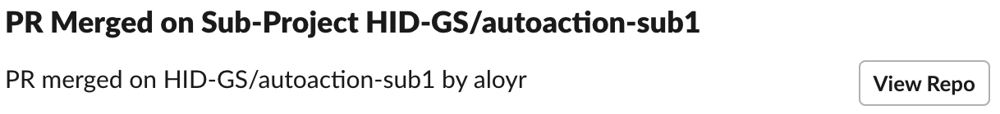

# Main repo

This repo implements the following workflow, reducing the number of touches from [5](http://dev2.hid.gl/plantuml/proxy?cache=no&src=https://raw.github.com/hid-gs/autoaction-main/main/docs/old-multi-app-workflow.txt) to 2, reducing the chance for human error, and making the process faster.

A more complete diagram that includes the CI steps looks like the following:

When a PR is created on a sub-module, a github action will send a slack notification to the web dev team channel asking for a PR review, with a link to the review.

Once a PR is reviewed, a github action triggers a notification to inform other devs, reporting who approved it and with a link to the PR rebase screen.

Once a PR is rebased, then a last notification to the team, with information on who rebased the PR and with a link to the updated codebase.

